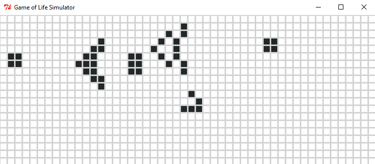

## Conway's Game of Life - Simulator

A description on the Game of Life can be found on [Wikipedia](https://en.wikipedia.org/wiki/Conway%27s_Game_of_Life).

#### Setup

This Code has been written in Python 3.10 and does not need any additional libraries.

#### How to use

Start the simulator entering `python start.py` in your favorite shell.

It comes with a generator for random initial states which will be used if nothing else has been specified.

Also it contains some samples in `examples.py` which can be used as `python start.py -e <example>`

##### Example:

`python start.py -e gosperGliderGun` will launch the simulator with the GosperGliderGun as initial state:

A full description of the CLI can be found in the `doc/CLI.md`.

#### License

This code is available with the MIT License. See LICENSE file for details.
